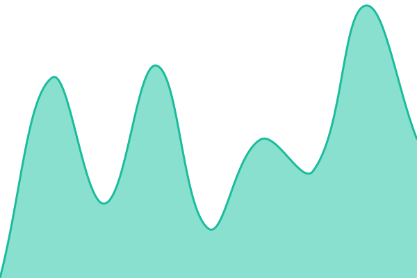
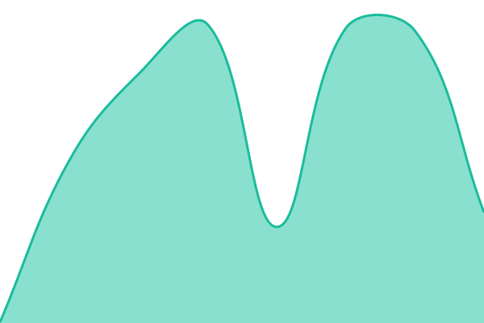

# [📈 Live Status](https://demo.upptime.js.org): <!--live status--> **🟩 All systems operational**

This repository contains the open-source uptime monitor and status page for [cameron-huntress](https://demo.upptime.js.org), powered by [Upptime](https://github.com/upptime/upptime).

With [Upptime](https://upptime.js.org), you can get your own unlimited and free uptime monitor and status page, powered entirely by a GitHub repository. We use [Issues](https://github.com/cameron-huntress/upptime_testing/issues) as incident reports, [Actions](https://github.com/cameron-huntress/upptime_testing/actions) as uptime monitors, and [Pages](https://demo.upptime.js.org) for the status page.

<!--start: status pages-->
<!-- This summary is generated by Upptime (https://github.com/upptime/upptime) -->
<!-- Do not edit this manually, your changes will be overwritten -->
<!-- prettier-ignore -->
| URL | Status | History | Response Time | Uptime |
| --- | ------ | ------- | ------------- | ------ |
|  [Huntress.com](https://huntress.com) | 🟩 Up | [huntress-com.yml](https://github.com/cameron-granger/upptime_testing/commits/HEAD/history/huntress-com.yml) | 

 628ms
     
 | 

<a href="https://cameron-huntress.github.io/upptime_testing/history/huntress-com">100.00%</a>
    

|  [Huntress Portal](https://huntress.io) | 🟩 Up | [huntress-portal.yml](https://github.com/cameron-granger/upptime_testing/commits/HEAD/history/huntress-portal.yml) | 

 132ms
     
 | 

<a href="https://cameron-huntress.github.io/upptime_testing/history/huntress-portal">100.00%</a>
    

<!--end: status pages-->

[**Visit our status website →**](https://demo.upptime.js.org)

## 📄 License

- Powered by: [Upptime](https://github.com/upptime/upptime)
- Code: [MIT](./LICENSE) © [cameron-huntress](https://demo.upptime.js.org)
- Data in the `./history` directory: [Open Database License](https://opendatacommons.org/licenses/odbl/1-0/)
